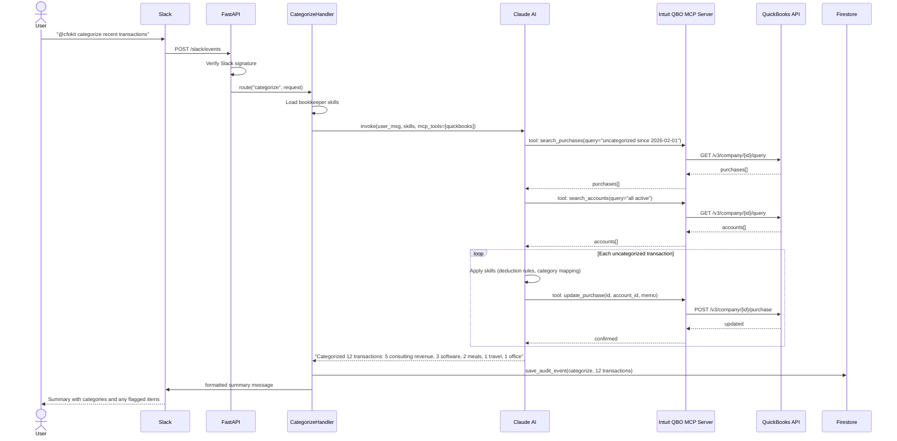
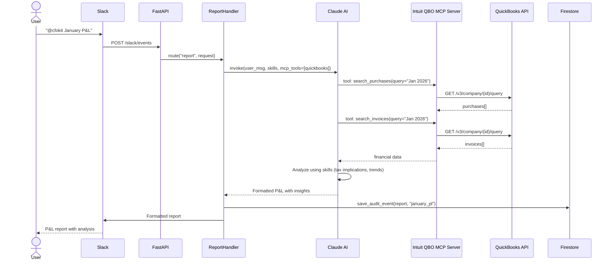
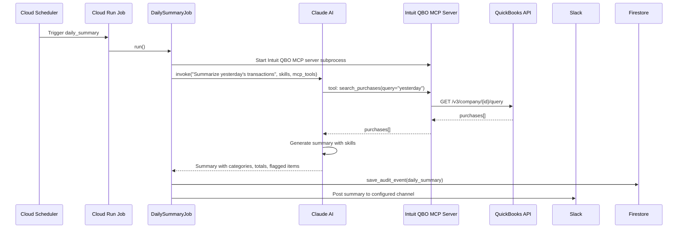
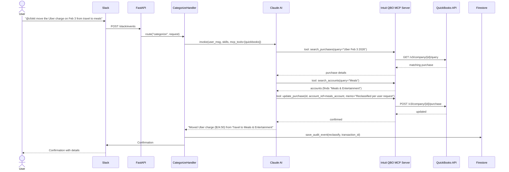

# CFOKit — Phase 1 Product Requirements Document

**Product:** CFOKit — The Open Source CFO Toolkit
**Phase:** 1 — Single-Business Bookkeeper on GCP
**Target Audience:** The author (single-member Delaware LLC with S-corp election, registered in NY, cash-basis consulting), and technically sophisticated open-source enthusiasts who want AI-assisted bookkeeping
**Date:** 2026-02-14

CFOKit is an open-source AI CFO toolkit. Phase 1 delivers a working bookkeeper agent for the author's business — a single-member Delaware LLC that elects S-corp taxation, registered in New York, operating on a cash basis as a consulting practice. The bookkeeper handles transaction categorization, report generation, and scheduled summaries — all driven by Claude AI with QuickBooks integration via MCP, deployed to GCP, and operated through Slack.

Multi-business support, additional agents (tax preparer, compliance monitor, cashflow analyst), and additional cloud providers are deferred to Phase 2+. This repository is the open-source project; operational concerns (monitoring, alerting, dashboards) for production deployment belong in a separate private infrastructure repository.

---

## Interaction Flows

Before defining stories, these sequence diagrams establish how the system actually works. All flows go through Claude AI, which uses QuickBooks MCP tools to read and write financial data.

### Transaction Categorization (On-Demand)

The core interaction. The user asks CFOKit to categorize recent transactions. Claude fetches uncategorized transactions from QuickBooks, applies domain knowledge from skills, categorizes each one, and updates QuickBooks.



### Report Generation

The user asks for a financial report. Claude pulls the data from QuickBooks and adds analysis.



### Initial Setup

First-time configuration: the user connects QuickBooks via OAuth and sets business parameters.


### Daily Summary (Scheduled)

Automated daily job. Cloud Scheduler triggers a Cloud Run Job that reviews the previous day's activity.



### Transaction Reclassification

The user asks to change a transaction's category. Claude finds and updates it.



---

## Success Criteria

Phase 1 is **done** when:

- A user can message CFOKit in Slack and get transactions categorized in QuickBooks
- A user can request P&L and transaction summary reports via Slack
- QuickBooks OAuth connect flow works end-to-end
- Intuit's QuickBooks Online MCP server reads and writes transactions via the QuickBooks API
- Scheduled jobs (daily summary, weekly review, monthly close) run automatically and post to Slack
- Business configuration (entity type, state, fiscal year) is persisted in Firestore
- Claude API usage is tracked and budget-capped
- Slack signature verification rejects unsigned/forged/replayed requests
- Sensitive data (OAuth tokens, API keys) is stored in Secret Manager, never in Firestore or logs
- GCP infrastructure (Cloud Run, Firestore, Secret Manager, Cloud Scheduler) deploys via `deploy.sh` with Terraform
- CI pipeline passes: lint, unit tests, integration tests
- Local development works in a dev container with zero manual setup
- Directory structure includes placeholder READMEs for AWS, Azure, and OpenClaw adapters

---

## Sub-phases

### Foundation (Weeks 1-3)

Build the repository, dev environment, and core GCP infrastructure. Provision Cloud Run, Firestore, and Secret Manager via Terraform and deploy a minimal health-check container — proving the deployment pipeline works from day one. Then build data models, QuickBooks MCP integration, skills, and shared utilities. At exit, a developer can clone the repo, open it in Claude Code or a dev container, run `uv run pytest` with all tests passing, and see a live health endpoint on Cloud Run.

**Exit criteria:**
- Dev container starts with all dependencies, emulators, and tooling pre-installed
- Health endpoint deployed to Cloud Run via `deploy.sh` and Terraform
- Cloud Run, Firestore, and Secret Manager provisioned in GCP
- Transaction and BusinessConfig models pass validation tests
- Intuit QBO MCP server starts as a subprocess and exposes expected tools
- Bookkeeper skills exist for consulting/cash-basis categorization
- Claude client, skill loader, MCP manager, and Slack client have tests
- `uv run pytest tests/unit/ -x` passes

### Core (Weeks 4-6)

Implement request handlers, GCP storage, and the FastAPI application with security. At exit, re-running `deploy.sh` deploys the full bookkeeper to the Cloud Run service provisioned in Foundation. The application handles Slack webhook requests end-to-end against live GCP services.

**Exit criteria:**
- Categorize, report, setup, and help handlers pass unit tests
- Firestore storage layer passes tests against emulator
- Secret Manager wrapper works for token storage
- FastAPI app routes Slack events to handlers
- Slack signature verification rejects invalid requests
- Rate limiting and Claude API budget caps are enforced
- QuickBooks OAuth callback endpoint stores tokens in Secret Manager
- Integration tests pass with TestClient + in-memory storage + mocked Claude
- Full application deployed to Cloud Run (re-run `deploy.sh`)

### Deploy (Weeks 7-9)

Scheduled jobs, Cloud Scheduler automation, security hardening, and documentation. Core GCP infrastructure has been running since Foundation. At exit, automated jobs run on schedule and the deployment is production-hardened.

**Exit criteria:**
- Cloud Scheduler and Cloud Run Jobs added to Terraform
- Daily summary, weekly review, and monthly close jobs run automatically on schedule
- Encryption and IAM hardened (least-privilege service accounts, documented)
- README, getting started guide, and GCP deployment guide are complete
- Placeholder READMEs exist for AWS, Azure, and OpenClaw directories

---

## Epics

### Epic 1: Repository Scaffolding & Dev Environment

> Set up the project structure, tooling, CI pipeline, and dev container that all subsequent work depends on.

**Sub-phase:** Foundation
**Dependencies:** None

#### Story 1.1: Initialize repository with uv and pyproject.toml

Create the Python project with `uv init`, configure `pyproject.toml` with project metadata, Python 3.11+ requirement, and dependency groups.

**Acceptance criteria:**
- `pyproject.toml` exists with project name `cfokit`, Python `>=3.11`
- Dev dependencies: pytest, pytest-asyncio, pytest-cov, pytest-timeout, ruff, mypy
- Runtime dependencies: anthropic, fastapi, uvicorn, pydantic, slack-sdk, mcp, google-cloud-firestore, google-cloud-secret-manager, httpx
- `uv sync` succeeds and creates `uv.lock`
- `.python-version` specifies 3.11
- `pyproject.toml` includes `[tool.pytest.ini_options]` with `asyncio_mode = "auto"`, `timeout = 30`
- `pyproject.toml` includes `[tool.coverage.run]` and `[tool.coverage.report]`

**Key files:** `pyproject.toml`, `uv.lock`, `.python-version`
**Labels:** `epic:scaffolding`, `sub-phase:foundation`
**blocks:** `[1.2, 1.3, 1.4, 1.5]`

---

#### Story 1.2: Create directory structure

Create all directories and `__init__.py` files. Include placeholder `README.md` files in future-phase directories (AWS, Azure, OpenClaw) describing what will be added.

**Acceptance criteria:**
- `core/` tree: `skills/`, `agents/`, `integrations/quickbooks_mcp/` (config + OAuth only — server is Intuit's), `models/`, `shared/`
- `deploy-cloud/shared/handlers/`, `deploy-cloud/shared/middleware/`, `deploy-cloud/shared/routes/`, `deploy-cloud/shared/jobs/`
- `deploy-cloud/gcp/adapters/`, `deploy-cloud/gcp/agents/cfo_bot/`, `deploy-cloud/gcp/agents/scheduled_jobs/`, `deploy-cloud/gcp/terraform/`
- `deploy-cloud/aws/README.md` — "AWS adapters (DynamoDB, Secrets Manager, SNS+SQS) planned for Phase 2"
- `deploy-cloud/azure/README.md` — "Azure adapters (Cosmos DB, Key Vault, Service Bus) planned for Phase 3"
- `deploy-openclaw/README.md` — "OpenClaw integration planned for Phase 2"
- `tests/unit/`, `tests/integration/`, `tests/cloud/`, `tests/e2e/`, `tests/fixtures/`
- Every Python package directory has an `__init__.py`

**Key files:** All `__init__.py` files, placeholder READMEs
**Labels:** `epic:scaffolding`, `sub-phase:foundation`
**blocks:** `[2.1, 3.1, 4.1, 5.1]`

---

#### Story 1.3: Configure linting and type checking

Set up ruff and mypy in `pyproject.toml`. Expand `.gitignore` for Python projects.

**Acceptance criteria:**
- `pyproject.toml` includes `[tool.ruff]` and `[tool.ruff.lint]` configuration
- `pyproject.toml` includes `[tool.mypy]` configuration targeting `core/` and `deploy-cloud/shared/`
- `uv run ruff check .` and `uv run ruff format --check .` pass
- `.gitignore` covers Python artifacts (`.venv`, `__pycache__`, `*.pyc`), `.env`, IDE files, cloud credential files

**Key files:** `pyproject.toml` (ruff/mypy sections), `.gitignore`
**Labels:** `epic:scaffolding`, `sub-phase:foundation`

---

#### Story 1.4: Set up CI pipeline with GitHub Actions

Create the CI workflow with lint, unit test, and integration test jobs.

**Acceptance criteria:**
- `.github/workflows/test.yml` exists with jobs: `lint`, `unit`, `integration`
- `lint` job runs ruff check, ruff format --check, and mypy
- `unit` job runs pytest with coverage reporting
- `integration` job runs integration tests
- All `uses:` actions reference commit SHAs, not tags

**Key files:** `.github/workflows/test.yml`
**Labels:** `epic:scaffolding`, `sub-phase:foundation`

---

#### Story 1.5: Create dev container for Claude Code

Create `.devcontainer/devcontainer.json` and supporting scripts for zero-friction local development. The container must work in Claude Code cloud containers.

**Acceptance criteria:**
- `.devcontainer/devcontainer.json` specifies Python 3.11+ base image
- Container installs `uv`, Node.js (for Intuit QBO MCP server), Google Cloud SDK, and Firestore emulator
- `postCreateCommand` runs `uv sync` to install all dependencies
- `postStartCommand` starts Firestore emulator in background
- Firestore emulator is accessible at `localhost:8080`
- `.env.example` lists all required environment variables with descriptions and placeholder values
- Developer can open repo in Claude Code, wait for container setup, and immediately run `uv run pytest`

**Key files:** `.devcontainer/devcontainer.json`, `.devcontainer/setup.sh`, `.env.example`
**Labels:** `epic:scaffolding`, `sub-phase:foundation`

---

### Epic 1B: GCP Infrastructure Bootstrap

> Provision core GCP infrastructure and deploy a minimal health-check container immediately after scaffolding. This follows a deploy-first principle: real cloud resources exist from the start, and every subsequent epic deploys incrementally to a live environment rather than building locally for weeks and doing a big-bang deployment at the end.

**Sub-phase:** Foundation
**Dependencies:** Epic 1

#### Story 1B.1: Create minimal deployable container

Create a throwaway skeleton FastAPI app with just a health endpoint and a Dockerfile. This exists solely to give us something to deploy to Cloud Run in Story 1B.3. Story 8.1 replaces this entirely with the real app factory and full route wiring.

**Acceptance criteria:**
- `deploy-cloud/gcp/agents/cfo_bot/app_minimal.py` provides a single-file FastAPI app with `GET /health` → `{"status": "healthy"}`
- `deploy-cloud/gcp/agents/cfo_bot/Dockerfile` builds a production container running the minimal app with `uvicorn`
- `docker build` succeeds and the container responds to health checks
- No dependency on any other `core/` or `deploy-cloud/shared/` code

**Key files:** `deploy-cloud/gcp/agents/cfo_bot/app_minimal.py`, `deploy-cloud/gcp/agents/cfo_bot/Dockerfile`
**Labels:** `epic:infra`, `sub-phase:foundation`
**blocks:** `[1B.2]`

---

#### Story 1B.2: Create Terraform modules for core GCP resources

Create Terraform modules for the three core GCP services needed from day one: Cloud Run (for the cfo_bot service), Firestore (for storage), and Secret Manager (for credentials). Compose them into a root configuration.

**Acceptance criteria:**
- `deploy-cloud/gcp/terraform/modules/cloud_run/` — Cloud Run service for cfo_bot (no Cloud Run Jobs yet — those are added in Story 10.1 when scheduled jobs exist)
- `deploy-cloud/gcp/terraform/modules/firestore/` — Firestore database and indexes
- `deploy-cloud/gcp/terraform/modules/secrets/` — Secret Manager secrets with IAM bindings (Cloud Run service account can read secrets)
- Each module has `main.tf`, `variables.tf`, `outputs.tf`
- `deploy-cloud/gcp/terraform/main.tf` composes cloud_run, firestore, and secrets modules
- `deploy-cloud/gcp/terraform/variables.tf` defines required variables with descriptions and validation (project_id, region, etc.)
- `deploy-cloud/gcp/terraform/outputs.tf` exposes Cloud Run service URL, Firestore database name, OAuth callback URL
- `deploy-cloud/gcp/terraform/terraform.tfvars.example` documents all variables
- `terraform validate` passes for each module and the root configuration

**Key files:** `deploy-cloud/gcp/terraform/modules/*/`, `deploy-cloud/gcp/terraform/main.tf`, `deploy-cloud/gcp/terraform/variables.tf`, `deploy-cloud/gcp/terraform/outputs.tf`, `deploy-cloud/gcp/terraform/terraform.tfvars.example`
**Labels:** `epic:infra`, `sub-phase:foundation`
**blocks:** `[1B.3]`

---

#### Story 1B.3: Create deploy script and perform first deployment

Create the deploy script and use it to perform the first deployment: a health-check container running on Cloud Run with Firestore and Secret Manager provisioned.

**Acceptance criteria:**
- `deploy-cloud/gcp/deploy.sh` automates: prerequisite checks (gcloud, terraform, docker), Docker image build and push to Artifact Registry, `terraform init && terraform apply`, secret configuration (prompts for values or reads from env), outputs the Cloud Run service URL and OAuth callback URL
- Script is idempotent (safe to re-run)
- `--dry-run` flag previews changes without applying
- Script does not contain hardcoded secrets
- First deployment succeeds: health endpoint returns 200 at the Cloud Run service URL

**Key files:** `deploy-cloud/gcp/deploy.sh`
**Labels:** `epic:infra`, `sub-phase:foundation`

---

### Epic 2: Data Models

> Define the Pydantic models for the domain entities.

**Sub-phase:** Foundation
**Dependencies:** Epic 1

#### Story 2.1: Implement Transaction model

Create the `Transaction` Pydantic model for cash-basis consulting transactions. Fields: id, date, amount, vendor, description, account_name, account_id, transaction_type (income/expense), source (bank_feed/manual), quickbooks_id, categorized_by (ai/manual), categorized_at, raw_data (dict for original QuickBooks payload).

**Acceptance criteria:**
- `core/models/transaction.py` defines `Transaction` as a Pydantic `BaseModel`
- `TransactionType` enum: `income`, `expense`
- `CategorizationSource` enum: `ai`, `manual`, `uncategorized`
- Validators: amount must be positive (refunds modeled as negative-amount income), date must not be in the future
- Model serializes to/from dict for Firestore compatibility
- Unit tests cover validators (not Pydantic builtins)

**Key files:** `core/models/transaction.py`, `tests/unit/test_models/test_transaction.py`
**Labels:** `epic:models`, `sub-phase:foundation`
**blocks:** `[2.2]`

---

#### Story 2.2: Implement BusinessConfig model

Create the `BusinessConfig` model for single-business configuration. This replaces the multi-client `Client` model — Phase 1 supports one business only. The primary configuration is the author's business: a single-member Delaware LLC with S-corp election, registered in NY.

**Acceptance criteria:**
- `core/models/business_config.py` defines `BusinessConfig` with fields: entity_type (enum: sole_prop, s_corp, llc), formation_state (str, e.g. "DE"), operating_state (str, e.g. "NY"), fiscal_year_start (date), slack_channel_id, quickbooks_company_id, quickbooks_connected (bool), created_at, updated_at
- `EntityType` enum: `sole_prop`, `s_corp`, `llc` — note that `s_corp` covers both direct S-corps and LLCs electing S-corp taxation (the tax treatment, not the legal form, determines which skills load)
- `formation_state` and `operating_state` are tracked separately because they determine different tax obligations (e.g., Delaware franchise tax vs. NY state income tax)
- Entity type determines which skills are loaded (S-corp loads reasonable compensation skill)
- Unit tests cover entity type validation, state validation, and fiscal year constraints

**Key files:** `core/models/business_config.py`, `tests/unit/test_models/test_business_config.py`
**Labels:** `epic:models`, `sub-phase:foundation`
**blocks:** `[2.3]`

---

#### Story 2.3: Create test factories and conftest

Implement `tests/factories.py` with factories for Transaction and BusinessConfig. Wire into `tests/conftest.py`.

**Acceptance criteria:**
- `TransactionFactory.create(**overrides)` returns a valid Transaction with sensible defaults (consulting income, recent date, categorized)
- `BusinessConfigFactory.create(**overrides)` returns a valid BusinessConfig — defaults to `entity_type=s_corp, formation_state="DE", operating_state="NY"` matching the author's business
- `create_batch(n)` returns `n` instances with unique IDs
- `tests/conftest.py` provides `transaction_factory` and `config_factory` fixtures
- `tests/conftest.py` provides `fixtures_dir` path fixture
- `tests/fixtures/` contains `sample_transactions.json` with representative consulting business transactions: client consulting income, payroll (owner reasonable compensation), software subscriptions, meals, travel, office supplies, Delaware franchise tax payment, NY state tax payment

**Key files:** `tests/factories.py`, `tests/conftest.py`, `tests/fixtures/sample_transactions.json`
**Labels:** `epic:models`, `sub-phase:foundation`

---

### Epic 3: QuickBooks MCP Integration

> Integrate Intuit's official QuickBooks Online MCP server ([intuit/quickbooks-online-mcp-server](https://github.com/intuit/quickbooks-online-mcp-server)) so Claude AI can read and write QuickBooks data. We use the official server rather than building our own — it supports CRUD on 11 entity types (Accounts, Bills, Customers, Invoices, Purchases, Vendors, etc.), handles OAuth with automatic token refresh, and is maintained by the company that makes QuickBooks.

**Sub-phase:** Foundation
**Dependencies:** Epic 1

#### Story 3.1: Integrate Intuit QuickBooks MCP server

Configure the Intuit QuickBooks Online MCP server as CFOKit's QuickBooks integration. The server is a TypeScript/Node.js process that CFOKit spawns as a subprocess and connects to over stdio (standard MCP transport).

**Tools available from the Intuit server (no code to write — these come for free):**
- Create, Read, Update, Delete, Search for: Accounts, Bills, Bill Payments, Customers, Employees, Estimates, Invoices, Items, Journal Entries, Purchases, Vendors

**Acceptance criteria:**
- `package.json` (or pinned npm dependency) includes `@anthropic/quickbooks-online-mcp-server` or equivalent reference to the Intuit server
- Dev container installs Node.js and the Intuit MCP server package
- `core/integrations/quickbooks_mcp/config.py` provides configuration for launching the server (command, args, environment variables for OAuth credentials)
- MCP manager (Story 5.3) can start the Intuit server as a subprocess and connect over stdio
- Credentials (client ID, client secret, refresh token, realm ID) are read from Secret Manager and passed to the server via environment variables
- Smoke test verifies the server starts and exposes expected tools

**Key files:** `core/integrations/quickbooks_mcp/config.py`, `package.json`
**Labels:** `epic:quickbooks`, `sub-phase:foundation`
**blocks:** `[3.2]`

---

#### Story 3.2: Implement QuickBooks OAuth flow

Create the OAuth 2.0 flow for the initial QuickBooks connection. The Intuit MCP server handles token refresh automatically once it has a refresh token, but CFOKit needs to handle the initial authorization flow: user clicks a link, authorizes in QuickBooks, and CFOKit captures the tokens.

**Acceptance criteria:**
- `core/integrations/quickbooks_mcp/oauth.py` provides:
  - `get_authorization_url()` — Generate QuickBooks OAuth URL with state parameter
  - `exchange_code(code, realm_id)` — Exchange authorization code for access + refresh tokens
- State parameter uses a cryptographic random value to prevent CSRF
- Tokens are stored via an injected secrets callback (Secret Manager in prod, dict in tests)
- Refresh token and realm ID are the values passed to the Intuit MCP server at startup
- Unit tests mock QuickBooks OAuth endpoints and verify: authorization URL generation, code exchange, CSRF state validation, error handling

**Key files:** `core/integrations/quickbooks_mcp/oauth.py`, `tests/unit/test_quickbooks_mcp/test_oauth.py`
**Labels:** `epic:quickbooks`, `sub-phase:foundation`

---

### Epic 4: CFO Skills & Agent Definition

> Author the domain knowledge and agent configuration that power the bookkeeper's financial intelligence.

**Sub-phase:** Foundation
**Dependencies:** Epic 1

#### Story 4.1: Author bookkeeper skills for cash-basis consulting

Create markdown skill files with domain knowledge relevant to categorizing transactions for a cash-basis consulting business.

**Skills to author:**
- `core/skills/consulting/transaction_categorization.md` — Common consulting expense categories (professional services income, software/SaaS subscriptions, meals & entertainment, travel, office expenses, professional development, insurance), how to identify them, categorization rules for ambiguous transactions
- `core/skills/consulting/cash_basis_accounting.md` — Cash basis rules, when to recognize revenue and expenses, implications for a consulting business (retainers, milestone payments, prepaid expenses)
- `core/skills/federal_tax/meal_deductions.md` — 50% deduction rules, documentation requirements, business meal vs. personal
- `core/skills/federal_tax/home_office.md` — Home office deduction rules for consultants (simplified method vs. regular method)
- `core/skills/s_corp/reasonable_compensation.md` — IRS reasonable compensation rules for S-corp owner-employees, salary vs. distribution split, payroll tax implications, how this applies to single-member LLCs with S-corp election
- `core/skills/s_corp/payroll_obligations.md` — Payroll categorization for owner-employee: salary, employer payroll taxes (FICA, FUTA, SUI), how to categorize payroll service fees
- `core/skills/state/delaware_franchise_tax.md` — Delaware LLC annual franchise tax ($300 flat fee), due date (June 1), how to categorize the payment
- `core/skills/state/ny_state_obligations.md` — NY state filing requirements for a Delaware LLC registered as a foreign LLC in NY, NY state income tax, NYC considerations if applicable

**Acceptance criteria:**
- Each skill file is well-structured markdown with clear headings
- Content is accurate and actionable for Claude (not just reference material — includes decision rules)
- Skills are scoped to the author's specific situation: single-member LLC with S-corp election, cash basis, consulting
- Each skill is under 50KB

**Key files:** `core/skills/consulting/*.md`, `core/skills/federal_tax/*.md`, `core/skills/s_corp/*.md`, `core/skills/state/*.md`
**Labels:** `epic:skills`, `sub-phase:foundation`
**blocks:** `[4.3]`

---

#### Story 4.2: Create bookkeeper agent YAML definition

Create the YAML agent definition for the bookkeeper agent. This defines which skills, tools, and triggers the bookkeeper uses.

**Acceptance criteria:**
- `core/agents/bookkeeper.yaml` defines:
  - `name`: bookkeeper
  - `description`: AI bookkeeper for cash-basis consulting businesses
  - `skills`: list of skill file paths — consulting and federal tax skills always loaded; S-corp skills loaded when entity_type is s_corp; state skills loaded based on formation_state and operating_state
  - `tools`: quickbooks_mcp
  - `triggers`: on-demand (Slack), daily-summary, weekly-review, monthly-close
- YAML parses without errors

**Key files:** `core/agents/bookkeeper.yaml`
**Labels:** `epic:skills`, `sub-phase:foundation`
**blocks:** `[4.3]`

---

#### Story 4.3: Create skill and agent tests

Tests for skill structure and agent YAML validation.

**Acceptance criteria:**
- Parameterized test auto-discovers all `core/skills/**/*.md` files and verifies: non-empty, under 50KB
- Bookkeeper agent YAML is tested for: valid YAML parse, required fields present, listed skill files exist on disk
- New skill files are auto-discovered without test code changes

**Key files:** `tests/unit/test_skills/test_skill_files.py`, `tests/unit/test_skills/test_agent_yaml.py`
**Labels:** `epic:skills`, `sub-phase:foundation`

---

### Epic 5: Shared Utilities

> Implement the cloud-agnostic utilities that handlers and agents depend on.

**Sub-phase:** Foundation
**Dependencies:** Epics 1, 3, 4

#### Story 5.1: Implement Claude API client

Create `core/shared/claude_client.py` wrapping the Anthropic Claude API. Includes token budget tracking to prevent runaway API costs.

**Acceptance criteria:**
- Async client for Claude API invocation
- User input goes exclusively in user-role messages
- Skill content goes in system context only
- MCP tools are passed through for Claude to use
- Token budget tracking: configurable daily/monthly token limits, raises `BudgetExceededError` when limit is reached
- Token usage is logged per invocation (input tokens, output tokens, total)
- Client is injectable (constructor takes API key and budget config)
- Unit tests verify: prompt construction safety (user input not in system prompt), skill content not in user role, budget enforcement, error handling for API failures

**Key files:** `core/shared/claude_client.py`, `tests/unit/test_claude_client.py`
**Labels:** `epic:utilities`, `sub-phase:foundation`

---

#### Story 5.2: Implement skill loader

Create `core/shared/skill_loader.py` that loads markdown skill files. Entity-type-aware: loads different skills based on the business configuration.

**Acceptance criteria:**
- `load_skills(agent_name, entity_type?)` loads the skills listed in the agent's YAML definition
- Entity type filtering: loads S-corp skills when entity_type is s_corp, state-specific skills based on formation_state and operating_state
- Path traversal protection: rejects `..`, absolute paths, and null bytes
- Returns dict mapping skill name → content string
- Unit tests: valid loading, entity-type filtering, path traversal rejection, nonexistent skill handling

**Key files:** `core/shared/skill_loader.py`, `tests/unit/test_skill_loader.py`
**Labels:** `epic:utilities`, `sub-phase:foundation`

---

#### Story 5.3: Implement MCP manager

Create `core/shared/mcp_manager.py` for managing MCP server connections. In Phase 1 this manages the Intuit QuickBooks Online MCP server, which runs as a Node.js subprocess connected over stdio.

**Acceptance criteria:**
- `MCPManager` spawns the Intuit QBO MCP server as a subprocess with credentials from Secret Manager passed as environment variables
- Connects to the server over stdio (standard MCP transport)
- Provides method to get the MCP tools list for passing to Claude
- Handles server lifecycle: start, health check, restart on crash, clean shutdown
- Connection health checking
- Unit tests: subprocess lifecycle, tool listing, restart behavior, credential passing (verifies secrets are passed as env vars, not logged)

**Key files:** `core/shared/mcp_manager.py`, `tests/unit/test_mcp_manager.py`
**Labels:** `epic:utilities`, `sub-phase:foundation`

---

#### Story 5.4: Implement Slack client

Create `core/shared/slack_client.py` for sending messages and formatting responses for Slack.

**Acceptance criteria:**
- Async methods for sending messages and responding to slash commands
- Message formatting supports Slack markdown blocks (headers, code blocks, bullet lists)
- Constructor takes bot token (injectable)
- Unit tests mock Slack API: message payload structure, channel targeting, error handling

**Key files:** `core/shared/slack_client.py`, `tests/unit/test_slack_client.py`
**Labels:** `epic:utilities`, `sub-phase:foundation`

---

### Epic 6: Request Handlers

> Implement the cloud-agnostic request handlers that process user commands. These live in `deploy-cloud/shared/` and depend on injected storage and utilities.

**Sub-phase:** Core
**Dependencies:** Epics 2, 3, 5

#### Story 6.1: Implement base handler

Create `deploy-cloud/shared/handlers/base_handler.py` with shared functionality for all handlers.

**Acceptance criteria:**
- `BaseHandler.__init__` accepts storage, secrets, claude_client, mcp_manager, slack_client, skill_loader
- `_emit_audit_event(action, details)` writes to `audit_events` collection — never includes secret values, tokens, or API keys
- `_format_error(error)` returns a user-friendly message with correlation ID — never includes stack traces, file paths, or internal details
- Unit tests verify: audit event structure, audit events do not contain secrets, error formatting excludes sensitive data

**Key files:** `deploy-cloud/shared/handlers/base_handler.py`, `tests/unit/test_handlers/test_base_handler.py`
**Labels:** `epic:handlers`, `sub-phase:core`
**blocks:** `[6.2, 6.3, 6.4, 6.5]`

---

#### Story 6.2: Implement categorize handler

The primary handler. Invokes Claude with bookkeeper skills and QuickBooks MCP tools to categorize transactions.

**Acceptance criteria:**
- `CategorizeHandler` extends `BaseHandler`
- `handle(request)` invokes Claude with:
  - User's message as the user prompt
  - Loaded bookkeeper skills as system context
  - QuickBooks MCP tools available for Claude to use
- Claude autonomously fetches transactions, categorizes them, and updates QuickBooks
- Handler captures Claude's summary response and sends to Slack
- Emits audit event with transaction count and categories
- Handles errors: QuickBooks connection failure, Claude API failure, budget exceeded
- Unit tests use mocked Claude client and mocked MCP; verify handler orchestration and error paths

**Key files:** `deploy-cloud/shared/handlers/categorize.py`, `tests/unit/test_handlers/test_categorize.py`
**Labels:** `epic:handlers`, `sub-phase:core`

---

#### Story 6.3: Implement report handler

Generates financial reports by invoking Claude with QuickBooks MCP tools.

**Acceptance criteria:**
- `ReportHandler` extends `BaseHandler`
- Supports report types: `monthly_pl`, `transaction_summary`
- Claude fetches data from QuickBooks and generates analysis
- Reports are sent to Slack and optionally saved to Firestore
- Emits audit event
- Unit tests verify report request routing and response formatting

**Key files:** `deploy-cloud/shared/handlers/report.py`, `tests/unit/test_handlers/test_report.py`
**Labels:** `epic:handlers`, `sub-phase:core`

---

#### Story 6.4: Implement setup handler

Guides business configuration and triggers QuickBooks OAuth connection.

**Acceptance criteria:**
- `SetupHandler` extends `BaseHandler`
- `handle(request)` creates or updates BusinessConfig in storage
- Validates entity type, state, fiscal year start
- Generates QuickBooks OAuth authorization URL when user requests connection
- Emits audit event for configuration changes
- Unit tests verify: config creation, validation errors, OAuth URL generation

**Key files:** `deploy-cloud/shared/handlers/setup.py`, `tests/unit/test_handlers/test_setup.py`
**Labels:** `epic:handlers`, `sub-phase:core`

---

#### Story 6.5: Implement help handler

Returns usage information and available commands.

**Acceptance criteria:**
- `HelpHandler` extends `BaseHandler`
- Returns available commands (categorize, report, setup, help) with usage examples
- Response formatted for Slack markdown
- Stateless — no storage access needed
- Unit test verifies response contains expected command names

**Key files:** `deploy-cloud/shared/handlers/help.py`, `tests/unit/test_handlers/test_help.py`
**Labels:** `epic:handlers`, `sub-phase:core`

---

### Epic 7: GCP Storage & Secrets

> Implement the GCP-specific storage and secrets layers. These are direct implementations against GCP services, not Protocol-based abstractions. The adapter pattern will be extracted when adding AWS in Phase 2.

**Sub-phase:** Core
**Dependencies:** Epic 1

#### Story 7.1: Implement Firestore storage layer

Create `deploy-cloud/gcp/adapters/storage.py` with typed methods for reading and writing domain objects to Firestore.

**Acceptance criteria:**
- `FirestoreStorage` provides async methods:
  - `save_transaction(transaction)` / `get_transaction(id)` / `list_transactions(date_from, date_to, account_id?)`
  - `save_config(config)` / `get_config()`
  - `save_audit_event(event)`
  - `query_transactions(filters)` for flexible querying
- Uses `google-cloud-firestore` async client
- All data is stored under a single project namespace (no multi-tenant namespacing for Phase 1)
- Documents are serialized/deserialized to/from Pydantic models
- Firestore indexes are defined in `deploy-cloud/gcp/firestore-indexes.json`

**Key files:** `deploy-cloud/gcp/adapters/storage.py`, `deploy-cloud/gcp/firestore-indexes.json`
**Labels:** `epic:gcp`, `sub-phase:core`
**blocks:** `[7.3]`

---

#### Story 7.2: Implement Secret Manager wrapper

Create `deploy-cloud/gcp/adapters/secrets.py` for reading and writing secrets (QuickBooks tokens, API keys).

**Acceptance criteria:**
- `SecretManagerClient` provides async methods:
  - `get_secret(name)` — Get latest version of a secret
  - `set_secret(name, value)` — Create or add new version
- Used by QuickBooks OAuth for token storage/retrieval
- `__repr__` and `__str__` never expose secret values
- Unit tests mock Secret Manager API

**Key files:** `deploy-cloud/gcp/adapters/secrets.py`, `tests/unit/test_gcp/test_secrets.py`
**Labels:** `epic:gcp`, `sub-phase:core`

---

#### Story 7.3: Create GCP cloud tests

Tests that run against the Firestore emulator to verify the storage layer works with real Firestore behavior.

**Acceptance criteria:**
- `tests/cloud/test_firestore_storage.py` tests all `FirestoreStorage` methods against emulator
- Tests cover: save/get round-trip, list with date filters, query operations, audit event storage, config persistence
- Session-scoped emulator fixture, function-scoped data cleanup
- Tests skip if `FIRESTORE_EMULATOR_HOST` is not set
- Tests marked with `@pytest.mark.gcp`

**Key files:** `tests/cloud/conftest.py`, `tests/cloud/test_firestore_storage.py`
**Labels:** `epic:gcp`, `sub-phase:core`

---

### Epic 8: FastAPI Application & Security

> Build the FastAPI application with security middleware and wire everything together.

**Sub-phase:** Core
**Dependencies:** Epics 5, 6, 7

#### Story 8.1: Create FastAPI application factory and GCP wiring

Create the app factory and the GCP-specific `app.py` that wires concrete implementations. This replaces the throwaway `app_minimal.py` from Story 1B.1 with the real application. After this story, re-running `deploy.sh` deploys the full bookkeeper to the Cloud Run service provisioned in Foundation.

**Acceptance criteria:**
- `deploy-cloud/shared/app_factory.py` provides `create_app(storage, secrets, claude_client, mcp_manager, slack_client, skill_loader)` returning a FastAPI instance
- Routes registered: `/slack/events` (POST), `/slack/commands` (POST), `/oauth/quickbooks/callback` (GET), `/health` (GET)
- `deploy-cloud/gcp/agents/cfo_bot/app.py` imports GCP implementations, instantiates them, and passes to `create_app()`
- Update `deploy-cloud/gcp/agents/cfo_bot/Dockerfile` (created in Story 1B.1) to run the full app instead of the minimal skeleton
- `app_minimal.py` is no longer used and can be deleted
- Application starts with `uvicorn`

**Key files:** `deploy-cloud/shared/app_factory.py`, `deploy-cloud/gcp/agents/cfo_bot/app.py`, `deploy-cloud/gcp/agents/cfo_bot/Dockerfile`
**Labels:** `epic:fastapi`, `sub-phase:core`
**blocks:** `[8.2, 8.3, 8.4, 8.5]`

---

#### Story 8.2: Implement Slack signature verification middleware

Verify Slack request signatures on all `/slack/*` endpoints.

**Acceptance criteria:**
- Middleware validates `X-Slack-Signature` using HMAC-SHA256 with signing secret
- Requests without signature headers return 401
- Requests with invalid signatures return 401
- Requests with timestamps older than 5 minutes return 401 (replay protection)
- Valid signatures pass through to handlers
- Unit tests: missing signature, invalid signature, expired timestamp, valid signature

**Key files:** `deploy-cloud/shared/middleware/slack_auth.py`, `tests/unit/test_middleware/test_slack_auth.py`
**Labels:** `epic:fastapi`, `sub-phase:core`

---

#### Story 8.3: Implement rate limiting and Claude API budget caps

Rate limiting for Slack requests and budget enforcement for Claude API usage.

**Acceptance criteria:**
- Request rate limiter: configurable threshold and window, returns 429 on breach
- Claude API budget: daily and monthly token limits (configurable via environment variables)
- Budget state persisted in Firestore (survives restarts)
- When budget is exceeded, handler returns a friendly "budget limit reached" message to Slack instead of processing the request
- Unit tests: rate limit enforcement, budget tracking, budget exceeded behavior

**Key files:** `deploy-cloud/shared/middleware/rate_limit.py`, `tests/unit/test_middleware/test_rate_limit.py`
**Labels:** `epic:fastapi`, `sub-phase:core`

---

#### Story 8.4: Implement Slack event routing and health endpoint

Route incoming Slack events to the appropriate handler. Health endpoint for load balancer probes.

**Acceptance criteria:**
- `/slack/events` handles Slack event callbacks (URL verification challenge, message events)
- `/slack/commands` handles slash command payloads
- Command parser extracts intent (categorize, report, setup, help) from message text
- Unknown commands route to help handler
- Invalid payloads return appropriate error responses (no stack traces, no internal paths)
- GET `/health` returns `{"status": "healthy"}` — no version numbers, no internal IPs
- Health response includes security headers (X-Content-Type-Options, X-Frame-Options)
- Unit tests and integration tests verify routing logic

**Key files:** `deploy-cloud/shared/routes/slack.py`, `deploy-cloud/shared/routes/health.py`, `tests/unit/test_routes/test_slack.py`, `tests/integration/test_fastapi_app.py`
**Labels:** `epic:fastapi`, `sub-phase:core`

---

#### Story 8.5: Implement QuickBooks OAuth callback endpoint

Handle the OAuth redirect after the user authorizes QuickBooks access.

**Acceptance criteria:**
- GET `/oauth/quickbooks/callback` receives authorization code and realm_id from QuickBooks
- Validates CSRF state parameter against stored state
- Exchanges code for access + refresh tokens via `quickbooks_oauth.exchange_code()`
- Stores tokens in Secret Manager
- Updates BusinessConfig with `quickbooks_connected=True` and `quickbooks_company_id`
- Redirects to a success page or returns success HTML
- Error handling: invalid state, expired code, QuickBooks API errors
- Unit tests mock QuickBooks OAuth and verify token storage

**Key files:** `deploy-cloud/shared/routes/oauth.py`, `tests/unit/test_routes/test_oauth.py`
**Labels:** `epic:fastapi`, `sub-phase:core`

---

#### Story 8.6: Create integration test suite

Integration tests using FastAPI TestClient with mocked storage and Claude client.

**Acceptance criteria:**
- `tests/integration/conftest.py` creates TestClient via `create_app()` with in-memory storage mock and mocked Claude/MCP
- Tests cover: Slack signature verification end-to-end, command routing (categorize/report/setup/help), handler invocation and response format, health endpoint
- Multi-step flow test: setup → categorize → report
- All integration tests pass without external services

**Key files:** `tests/integration/conftest.py`, `tests/integration/test_fastapi_app.py`, `tests/integration/test_handler_flows.py`
**Labels:** `epic:fastapi`, `sub-phase:core`

---

### Epic 9: Scheduled Jobs

> Implement automated scheduled jobs. Business logic lives in `deploy-cloud/shared/jobs/` (cloud-agnostic). The GCP-specific entry point in `deploy-cloud/gcp/` is a thin wrapper.

**Sub-phase:** Deploy
**Dependencies:** Epics 5, 6, 7, 8

#### Story 9.1: Implement daily summary job

Review the previous day's transactions and post a summary to Slack.

**Acceptance criteria:**
- `deploy-cloud/shared/jobs/daily_summary.py` contains the business logic
- Invokes Claude with QuickBooks MCP tools to fetch yesterday's transactions
- Generates summary: transaction count, total income, total expenses, categories breakdown, flagged items
- Posts formatted summary to configured Slack channel
- Emits audit event
- Unit tests verify summary generation and Slack message structure

**Key files:** `deploy-cloud/shared/jobs/daily_summary.py`, `tests/unit/test_jobs/test_daily_summary.py`
**Labels:** `epic:jobs`, `sub-phase:deploy`

---

#### Story 9.2: Implement weekly review job

Generate a weekly financial summary with trends.

**Acceptance criteria:**
- `deploy-cloud/shared/jobs/weekly_review.py` contains the business logic
- Fetches the week's data via Claude + QuickBooks MCP
- Includes: total income/expenses, top spending categories, week-over-week comparison, action items
- Posts to Slack
- Emits audit event
- Unit tests verify metrics and message format

**Key files:** `deploy-cloud/shared/jobs/weekly_review.py`, `tests/unit/test_jobs/test_weekly_review.py`
**Labels:** `epic:jobs`, `sub-phase:deploy`

---

#### Story 9.3: Implement monthly close job

Generate month-end close package.

**Acceptance criteria:**
- `deploy-cloud/shared/jobs/monthly_close.py` contains the business logic
- Generates: P&L summary, expense breakdown by category, uncategorized transaction alerts, reconciliation checklist
- Posts close package to Slack and persists to Firestore
- Emits audit event
- Unit tests verify close package structure

**Key files:** `deploy-cloud/shared/jobs/monthly_close.py`, `tests/unit/test_jobs/test_monthly_close.py`
**Labels:** `epic:jobs`, `sub-phase:deploy`

---

#### Story 9.4: Create Cloud Run Jobs entry point

GCP-specific entry point that instantiates dependencies and dispatches to the cloud-agnostic job logic.

**Acceptance criteria:**
- `deploy-cloud/gcp/agents/scheduled_jobs/main.py` accepts job name as argument (`daily_summary`, `weekly_review`, `monthly_close`)
- Instantiates Firestore storage, Secret Manager, Claude client, MCP manager, Slack client
- Calls the appropriate shared job function
- `deploy-cloud/gcp/agents/scheduled_jobs/Dockerfile` builds the container
- Exit code reflects success (0) or failure (non-zero)

**Key files:** `deploy-cloud/gcp/agents/scheduled_jobs/main.py`, `deploy-cloud/gcp/agents/scheduled_jobs/Dockerfile`
**Labels:** `epic:jobs`, `sub-phase:deploy`

---

### Epic 10: GCP Deployment Completion & Hardening

> Add Cloud Scheduler for automated jobs and harden the existing GCP deployment with encryption, IAM, and configuration files. Core GCP infrastructure (Cloud Run service, Firestore, Secret Manager) was provisioned in Epic 1B during Foundation and has been running since. This epic completes the deployment by adding scheduled job automation and production-grade security.

**Sub-phase:** Deploy
**Dependencies:** Epics 7, 8, 9

#### Story 10.1: Add Cloud Scheduler and Cloud Run Jobs to Terraform

Extend the Terraform configuration (created in Story 1B.2) with Cloud Run Jobs for scheduled tasks and Cloud Scheduler triggers.

**Acceptance criteria:**
- `deploy-cloud/gcp/terraform/modules/cloud_run/` updated to include Cloud Run Jobs resources (daily_summary, weekly_review, monthly_close)
- `deploy-cloud/gcp/terraform/modules/scheduler/` created with Cloud Scheduler jobs: daily (8am), weekly (Monday 8am), monthly (1st of month 8am) — all configurable
- `deploy-cloud/gcp/terraform/main.tf` updated to compose the scheduler module
- Scheduled jobs service account is scoped to required permissions only
- `terraform validate` passes
- Re-running `deploy.sh` provisions the new resources alongside the existing deployment

**Key files:** `deploy-cloud/gcp/terraform/modules/cloud_run/`, `deploy-cloud/gcp/terraform/modules/scheduler/`, `deploy-cloud/gcp/terraform/main.tf`
**Labels:** `epic:infra`, `sub-phase:deploy`
**blocks:** `[10.2]`

---

#### Story 10.2: Create GCP configuration files

Supporting configuration files for the GCP deployment.

**Acceptance criteria:**
- `deploy-cloud/gcp/slack/app-manifest.yaml` — Slack app configuration (OAuth scopes, event subscriptions, slash commands)
- `deploy-cloud/gcp/slack/setup-guide.md` — Step-by-step Slack app setup
- `deploy-cloud/gcp/cloud-run-service.yaml` — Cloud Run service config (scaling, resources, env)
- `deploy-cloud/gcp/cloud-run-jobs.yaml` — Cloud Run Jobs config for 3 scheduled tasks

**Key files:** `deploy-cloud/gcp/slack/`, `deploy-cloud/gcp/cloud-run-*.yaml`
**Labels:** `epic:infra`, `sub-phase:deploy`

---

#### Story 10.3: Configure encryption and IAM

Ensure sensitive data is encrypted and access is minimized.

**Acceptance criteria:**
- Firestore data encrypted at rest (GCP default, documented)
- All secrets stored in Secret Manager, never in Firestore, environment variables in production, or application logs
- Cloud Run service account has minimum required IAM roles (Firestore read/write, Secret Manager accessor, Pub/Sub publisher)
- Scheduled jobs service account is scoped to required permissions only
- OAuth tokens stored in Secret Manager with restricted access
- Documented in `deploy-cloud/gcp/terraform/README.md`: IAM roles, encryption configuration, secret rotation procedure

**Key files:** `deploy-cloud/gcp/terraform/README.md`, IAM configuration in Terraform modules
**Labels:** `epic:infra`, `sub-phase:deploy`

---

### Epic 11: Documentation

> Minimum viable documentation for the open-source release.

**Sub-phase:** Deploy
**Dependencies:** All previous epics

#### Story 11.1: Write README

The project's front door. Should communicate what CFOKit does, how to get started, and what's coming next.

**Acceptance criteria:**
- Tagline and value proposition
- Feature summary (bookkeeper agent, QuickBooks integration, Slack interface, scheduled summaries)
- Quick start (link to getting started guide)
- Architecture overview (link to architecture section)
- Current limitations (single business, GCP only, cash basis only)
- Roadmap: multi-business, AWS/Azure, OpenClaw, additional agents
- Contributing section
- License (MIT)

**Key files:** `README.md`
**Labels:** `epic:docs`, `sub-phase:deploy`

---

#### Story 11.2: Write getting started guide

End-to-end guide from zero to working deployment.

**Acceptance criteria:**
- Prerequisites: GCP account, Slack workspace, QuickBooks Online account, Anthropic API key
- Dev container setup (clone, open in Claude Code, automatic environment)
- GCP deployment walkthrough (deploy.sh)
- Slack app setup (reference setup-guide.md)
- QuickBooks connection (OAuth flow walkthrough)
- First interaction walkthrough (setup → categorize → report)
- Troubleshooting common issues

**Key files:** `docs/getting-started.md`
**Labels:** `epic:docs`, `sub-phase:deploy`

---

#### Story 11.3: Write GCP deployment guide

Detailed deployment reference beyond the quick start.

**Acceptance criteria:**
- Terraform variable reference table
- IAM and security configuration
- Cost estimation for a single business
- Secret rotation procedures
- Updating and redeploying

**Key files:** `docs/deployment-guide-gcp.md`
**Labels:** `epic:docs`, `sub-phase:deploy`

---

## Epic Dependency Graph

```
                    ┌─────────────────────────────────────┐
                    │  Epic 1: Scaffolding & Dev Env       │
                    │        (no dependencies)             │
                    └──────┬──────────┬──────────┬─────────┘
                           │          │          │
                    ┌──────▼──────┐   │          │
                    │  Epic 1B    │   │          │
                    │ GCP Infra   │   │          │
                    │ Bootstrap   │   │          │
                    │ ★ DEPLOY 1  │   │          │
                    └──────┬──────┘   │          │
                           │          │          │
                    ┌──────▼──┐  ┌────▼────┐  ┌──▼──────────┐
                    │ Epic 2  │  │ Epic 3  │  │   Epic 4    │
                    │ Models  │  │QuickBooks│  │Skills/Agent │
                    │         │  │  MCP    │  │             │
                    └────┬────┘  └────┬────┘  └──────┬──────┘
                         │            │              │
                         │            └──────┬───────┘
                         │                   │
                         │           ┌───────▼───────┐
                         │           │   Epic 5      │
                         │           │  Utilities    │
                         │           └───────┬───────┘
                         │                   │
                    ┌────▼───────────────────▼──┐  ┌──────────────┐
                    │       Epic 6              │  │   Epic 7     │
                    │    Request Handlers       │  │  GCP Storage │
                    └──────────┬────────────────┘  └──────┬───────┘
                               │                          │
                           ┌───▼──────────────────────────▼──┐
                           │         Epic 8                  │
                           │   FastAPI App + Security        │
                           │      ★ DEPLOY 2 (re-run)       │
                           └───┬─────────────────────────────┘
                               │
                        ┌──────▼──────┐
                        │  Epic 9     │
                        │Sched. Jobs  │
                        └──────┬──────┘
                               │
                        ┌──────▼──────┐
                        │  Epic 10    │
                        │ Scheduler   │
                        │ + Hardening │
                        │ ★ DEPLOY 3  │
                        └──────┬──────┘
                               │
                        ┌──────▼──────┐
                        │  Epic 11    │
                        │    Docs     │
                        └─────────────┘
```

Three deployment milestones:
- **DEPLOY 1** (Foundation): Health endpoint on Cloud Run — proves the pipeline
- **DEPLOY 2** (Core): Full bookkeeper on Cloud Run — Slack commands work against live GCP
- **DEPLOY 3** (Deploy): Cloud Scheduler + Cloud Run Jobs — automated summaries running

---

## Parallel Execution Tracks

### Track 1: After Epic 1 completes (4 agents in parallel)

```
Agent A: Epic 1B (GCP Infra Bootstrap) ───────────┐
Agent B: Epic 2 (Data Models) ────────────────────┤
Agent C: Epic 3 (QuickBooks MCP) ─────────────────┤──> Epic 5 (Utilities)
Agent D: Epic 4 (Skills & Agent Definition) ──────┘
```

### Track 2: After Foundation completes (2 agents in parallel)

```
Agent A: Epic 6 (Request Handlers) ─────┐
                                         ├──> Epic 8 (FastAPI App) ──> ★ DEPLOY 2
Agent B: Epic 7 (GCP Storage & Secrets) ┘
```

### Track 3: After Core completes

```
Epic 9 (Scheduled Jobs) ──> Epic 10 (Scheduler + Hardening) ──> ★ DEPLOY 3 ──> Epic 11 (Docs)
```

---

## Non-Goals (Phase 1)

The following are explicitly **out of scope** for Phase 1:

- **Multi-business support** — Phase 1 supports a single business only. Multi-business with per-business agent instances is deferred to Phase 2.
- **Additional agents** — Tax preparer, compliance monitor, and cashflow analyst agents are deferred to Phase 2.
- **Adapter protocol abstraction** — Phase 1 builds directly against GCP. Protocol-based abstractions will be extracted when adding AWS in Phase 2.
- **AWS deployment** — Deferred to Phase 2.
- **Azure deployment** — Deferred to Phase 3.
- **OpenClaw integration** — Deferred to Phase 2. Placeholder README only.
- **Accrual basis accounting** — Cash basis only in Phase 1.
- **Wave and Stripe integrations** — QuickBooks only in Phase 1.
- **Nonprofit entity types** (501(c)(3), 501(c)(6)) — Deferred to Phase 2. Phase 1 supports sole_prop, s_corp (including LLCs with S-corp election), and llc.
- **E-filing integration** — Deferred to Phase 4.
- **Web dashboard** — All interaction is via Slack.
- **Multi-currency** — USD only.
- **State tax expansion** — Federal + Delaware + NY only in Phase 1. Additional states deferred.
- **Operational automation** (monitoring, alerting, dashboards) — Belongs in a separate private infrastructure repository, not this open-source project.
- **CLI interface** — Slack is the primary interface for Phase 1. CLI may be added in Phase 2 for developer convenience.

---

## Story Summary

| Sub-phase | Epic | Stories |
|-----------|------|---------|
| Foundation | 1. Repository Scaffolding & Dev Environment | 5 |
| Foundation | 1B. GCP Infrastructure Bootstrap | 3 |
| Foundation | 2. Data Models | 3 |
| Foundation | 3. QuickBooks MCP Integration | 2 |
| Foundation | 4. CFO Skills & Agent Definition | 3 |
| Foundation | 5. Shared Utilities | 4 |
| Core | 6. Request Handlers | 5 |
| Core | 7. GCP Storage & Secrets | 3 |
| Core | 8. FastAPI Application & Security | 6 |
| Deploy | 9. Scheduled Jobs | 4 |
| Deploy | 10. GCP Deployment Completion & Hardening | 3 |
| Deploy | 11. Documentation | 3 |
| **Total** | | **44** |
